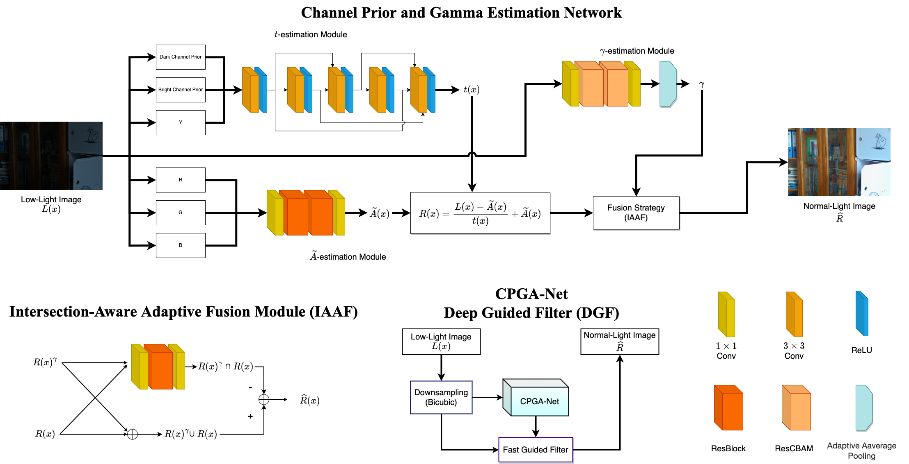
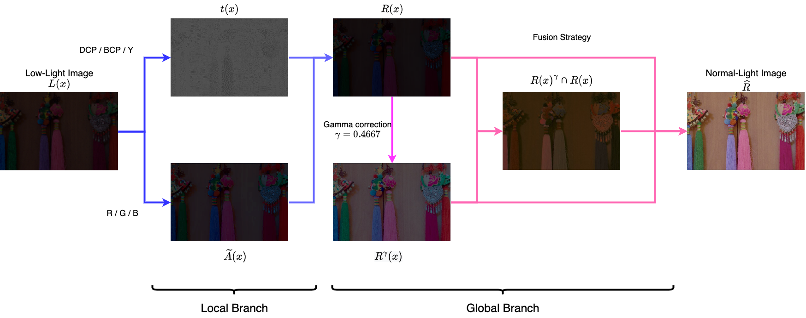
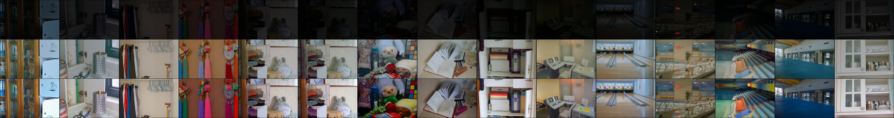

# Implementation of "A Lightweight Low-Light Image Enhancement Network via Channel Prior and Gamma Correction"

This is the implementation of CPGA-Net based on Pytorch.
"A Lightweight Low-Light Image Enhancement Network via Channel Prior and Gamma Correction"

# News

* 2023/11/17 Upload repository
# Preparation
1. clone the project
2. install [Pytorch](https://pytorch.org/)
3. execute the following instruction: 
```
// python=3.8
pip install -r requirements.txt
```
4. make sure these modules have been successfully installed
# Structure

## Details


# Usage
## Data Preparation

Prepare your data, split it into Low-Light images and Normal Light images, both image folder should be paired and the same pair of images should be have the same name. It should be almost the same as original listing way.

## Train
```
python train.py  \
    "--epochs", "10" , \
    "--net_name", "YOUR_NETNAME" , \
    "--lr", "1e-4",

    "--num_workers", "2" , \
    "--batch_size", "16" , \
    "--val_batch_size", "1" , \

    "--model_dir" ,"./models" , \
    "--log_dir", "./logs", \
    "--sample_output_folder", "./samples/", \

    "--ori_data_path", "LOL_TRAIN_HIGH", \
    "--haze_data_path", "LOL_TRAIN_LOW", \
    "--val_ori_data_path", "LOL_TEST_HIGH" , \
    "--val_haze_data_path", "LOL_TEST_LOW" , \
    "--dataset_type", "LOL-v1", \

    "--ckpt", "weights/enhance_color-llie-ResCBAM_g.pkl" 
```

## Demo
```
python demo_enhanced.py \
     "--net_name", "YOUR_NETNAME" , \

    "--val_ori_data_path", "LOL_TEST_HIGH" , \
    "--val_haze_data_path", "LOL_TEST_LOW" , \
    "--dataset_type", "LOL-v1", \
    
    "--num_workers", "1" , \ 
    "--val_batch_size", "1" , \ 

    "--ckpt", "weights/enhance_color-llie-ResCBAM_g.pkl" 
```
## Demo Video
```
python demo_enhanced_video.py \

    "--output_name", "OUTPUT_PATH", \
    "--video_dir", "VIDEO_PATH_or_IMAGE_SEQ_DIR" , \
    "--num_workers", "0" , \
    "--val_batch_size", "1", \

    "--ckpt", "weights/enhance_color-llie-ResCBAM_g.pkl" 
```
## Evaluation
```
python evaluation.py \
    "--dirA", "DIR_A", \
    "--dirB", "DIR_B"
```

## Dataset Selection
### For LOLv2
```
    "--ori_data_path", "LOLv2_PATH", \
    "--haze_data_path", "LOLv2_PATH", \
    "--val_ori_data_path", "LOLv2_PATH", \
    "--val_haze_data_path", "LOLv2_PATH", \
    
    "--dataset_type", "LOL-v2-real", //"LOL-v2-real" or "LOL-v2-Syn"
```
### For Exposure Error Dataset (Training)
```
    "--ori_data_path", "TRAIN_GT_IMAGES", \
    "--haze_data_path", "TRAIN_INPUT_IMAGES", \
    "--val_ori_data_path", "VAL_GT_IMAGES", \
    "--val_haze_data_path", "VAL_INPUT_IMAGES", \
    
    "--dataset_type", "expe",
```
### For Exposure Error Dataset (Demo)
```
    "--val_ori_data_path", "INPUT_IMAGES_PATH", \
    "--val_haze_data_path", "INPUT_IMAGES_PATH", \
    
    "--dataset_type", "LOL-v1",
```
### For Unpaired Dataset (DEMO: LIME, MEF, DICM, NPE, VV)
```
    "--val_ori_data_path", "Unpaired_PATH" , \
    "--val_haze_data_path", "Unpaired_PATH" , \
    
    "--dataset_type", "LOL-v1",
```
### For your custom images dir (Demo)
```
    "--val_ori_data_path", "/mnt/d/datasets/exposure error/testing/INPUT_IMAGES",\
    "--val_haze_data_path", "/mnt/d/datasets/exposure error/testing/INPUT_IMAGES",\
    
    "--dataset_type", "LOL-v1",
```
## Weights
CPGA-Net
```
weights/enhance_color-llie-ResCBAM_g-vggloss.pkl
```
CPGA-Net (DGF)
```
weights/enhance_color-llie-ResCBAM_g-8-DGF.pkl
```
# Results
The metrics were calculated by The evaluation code from [HWMNet
](https://github.com/FanChiMao/HWMNet.git)  
Flops were calculated by [fvcore](https://github.com/facebookresearch/fvcore)
Flops and Inference time were using a input with 600×400×3 random generated tensor for testing with GPU Nvidia GeForce 3090
## LOL-Test(15 pics)
|      | PSNR (dB)| SSIM  | LPIPS |Flops(G) | Params(M) | Inference Speed|
| ---- | ----  | ----  |  ---- | ----   | ---- | ---- |
|  CPGA-Net   |20.00  | 0.714 | 0.284 | 6.0324 |  0.0415  | 40.284 |
|  CPGA-Net (DGF)   |19.59  | 0.708 | 1.514 | 1.0970 |  0.0184 | 5.158 |



## LIME/NPE/MEF/DICM/VV (using NIQE)

|      |  MEF | LIME | NPE |VV |DICM | Avg|
| ---- | ---- |---- |---- |---- |---- | ----|
|  CPGA-Net   | 3.8698 |3.7068|	3.5476|	2.2641|	2.6934|	3.216|	
|  CPGA-Net (DGF)  |  3.8272|	3.834|	3.4975	|2.2336	|3.0361|	3.286|

## Exposure Error (avg)
|      | PSNR (dB)| SSIM  | LPIPS |
| ---- | ----  | ----  |  ---- | 
|  CPGA-Net   | 19.90  | 0.809 | 0.184 | 


# Acknowledge
Lots of code were borrowed from [pytorch version of AOD-Net](https://github.com/walsvid/AOD-Net-PyTorch)  
Evaluation code was borrowed from [HWMNet](https://github.com/walsvid/AOD-Net-PyTorch)
